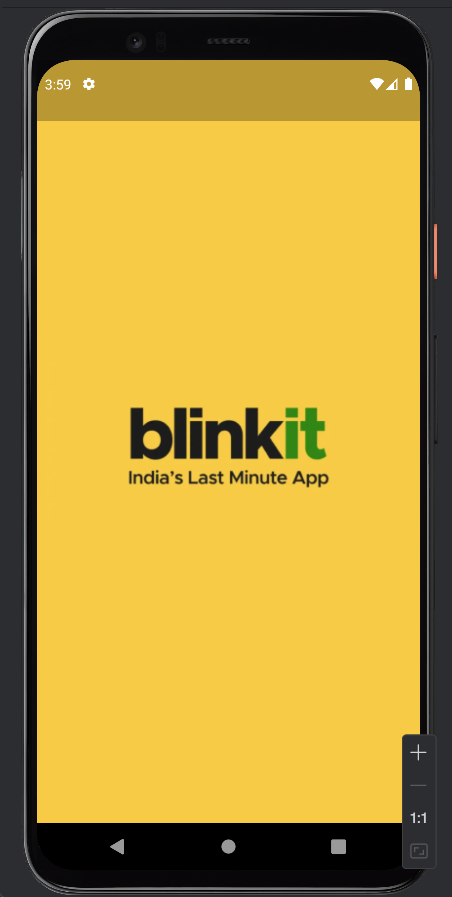

# Blinkit UI Clone

A UI clone of the Blinkit app built using Flutter. This project was my first attempt at Flutter development.

## Objective
The goal of this project was to understand Flutter's UI-building paradigm by replicating a familiar app interface. Having prior experience in mobile app development with Jetpack Compose, I wanted to compare the similarities and differences in UI implementation between Compose and Flutter. 

Through this project, I explored Flutter’s widget system, including:
- Building reusable UI components similar to Jetpack Compose's wrappers around primitives like `Text`, `TextField`, and `Button`.
- Implementing various UI elements such as search bars, buttons, bottom navigation bars, lists, grids, and stacks.
- Understanding navigation and screen transitions in Flutter.

## App Screens
Below are the key screens implemented in this project:

<table>
  <tr>
    <td></td>
    <td></td>
  </tr>
  <tr>
    <td></td>
    <td></td>
  </tr>
  <tr>
    <td></td>
    <td></td>
  </tr>
</table>

## Lessons Learned
- Flutter's `Widget` tree is conceptually similar to Jetpack Compose's Composables, but the lifecycle and state management work differently.
- Navigation in Flutter is managed using `Navigator` and routes, whereas Compose uses the `NavController` and `NavHost`.
- Flutter requires explicit layout widgets like `Column`, `Row`, and `Stack`, whereas Compose relies on `Modifier` for styling and layout.
- Building reusable UI components in Flutter follows a slightly different approach compared to Jetpack Compose.

This project was a great learning experience, and I look forward to building more apps with Flutter!
